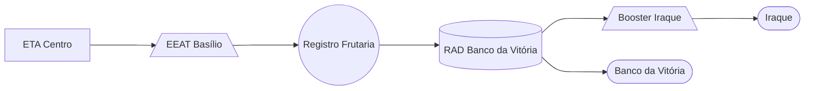

### Booster Iraque (AUTAG)

Abastecimento normalmente entre `04:00` e `10:00`

| Parâmetro     | Valor |
| -------------    | ------------- |
| Início horário de ponta  | 10:00 |
| Final horário de ponta  | 23:59 |
| Desliga máx. jusante  | 60,00 mca|
| Liga mín. jusante  | 24,00 mca|
| Liga máx. montante  | 0,60 m|
| Desliga mín. montante  | 0,20 m|
| Frequência  | - |
| Setpoint  | - |

Pontos relacionados:
- [49949687 - Rua Alpidio Ramos 351](https://www.vectorasys.com.br/vectorasys/?inc=jE9ciFZdkq5eiPI/kPRdHL0fUgHpk249WBY3VqHeku9slPteHB1pGu94UuRqHrM=)
- [49947610 - RUA GETÚLIO DOMINGOS 30](https://www.vectorasys.com.br/vectorasys/?inc=jE9ciFZdkq5eiPI/kPRdHL0fUgHpk249WBk5UKHeku9slPteHB1pGu94UrVtHBG=)
  

