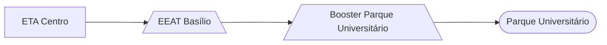

### Booster Parque Universitário (AUTAG)

Abastecimento normalmente entre `05:00` e `08:00` e entre `12:00` e `13:00` 

| Parâmetro     | Valor |
| -------------    | ------------- |
| Desliga máx. jusante  | 60,00 mca|
| Liga mín. jusante  | 22,00 mca|
| Liga máx. montante  | 15,00 mca|
| Desliga mín. montante  | 2,00 mca|

Pontos relacionados:
- [49949660 - Rua Prof. Jorge Fialho 62](https://www.vectorasys.com.br/vectorasys/?inc=jE9ciFZdkq5eiPI/kPRdHL0fUgHpk249WBY3VKHeku9slPteHB1pGu94UuZpVhI=)
  

