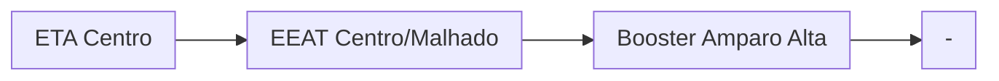

### Booster Amparo Alta (AUTAG)
| Parâmetro     | Valor |
| -------------    | ------------- |
| Início horário de ponta  | 12:00 |
| Final horário de ponta  | 23:59 |
| Desliga máx. jusante  | 80,0 mca|
| Liga mín. jusante  | 58,0 mca|
| Liga máx. montante  | 20,0 mca|
| Desliga mín. montante  | 4,0 mca|

Pontos relacionados:
- [49947823 - RUA AMENDOEIRA 226 MAT 4662169](https://www.vectorasys.com.br/vectorasys/?inc=jE9ciFZdkq5eiPI/kPRdHL0fUgHpk249WBU4VKHeku9slPteHB1pGu94UrDrHrY=)
- [49701925 - OITAVA TRAVESSA LEGIÃO 53 S 33](https://www.vectorasys.com.br/vectorasys/?inc=jE9ciFZdkq5eiPI/kPRdHL0fUgHpk249WBCgWAHeku9slPteHB1pGu94UuCgHrG=)
- [49701960 - R BELA VISTA ALTO D LEGIÃO S33](https://www.vectorasys.com.br/vectorasys/?inc=jE9ciFZdkq5eiPI/kPRdHL0fUgHpk249WBChUKHeku9slPteHB1pGu94UrQ0VrM=)

