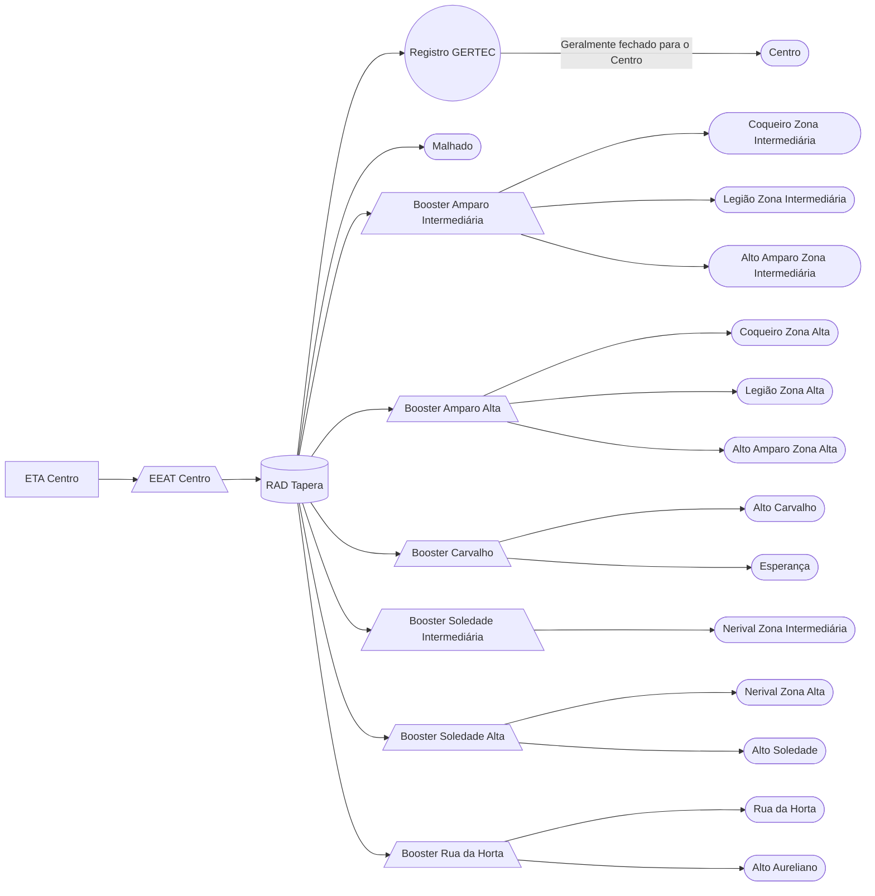

### EEAT Centro/Malhado (AUTAG)

Abastecimento normalmente entre `23:00` e `13:00`

| Parâmetro     | Valor |
| -------------    | ------------- |
| Início horário de ponta  | 15:30 |
| Final horário de ponta  | 22:30 |
| Desliga máx. jusante  | 4,00 m|
| Liga mín. jusante  | 3,00 m|
| Liga máx. montante  | 2,10 m|
| Desliga mín. montante  | 1,20 m|
| Frequência  | 54 hz|
| Setpoint  | 3,50 m|

Pontos relacionados:
- [49945148 - MALHADO MAT 46254129](https://www.vectorasys.com.br/vectorasys/?inc=jE9ciFZdkq5eiPI/kPRdHL0fUgHpk249WBUgUAHeku9slPteHB1pGu94UuNsUBM=)
- [49945532 - AVN GOVERNADOR ROBERTO SANTOS](https://www.vectorasys.com.br/vectorasys/?inc=jE9ciFZdkq5eiPI/kPRdHL0fUgHpk249WBkeVAHeku9slPteHB1pGu94UrVuHrU=)
- [49945501 - AVN UBAITABA 1251 MAT 46324348](https://www.vectorasys.com.br/vectorasys/?inc=jE9ciFZdkq5eiPI/kPRdHL0fUgHpk249WBU4UqHeku9slPteHB1pGu94UuHtVhk=)
  

