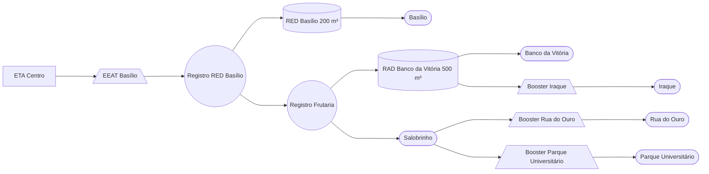

### EEAT Basílio (AUTAG)

Abastecimento normalmente entre `22:00` e `16:00`

| Parâmetro     | Valor |
| -------------    | ------------- |
| Início horário de ponta  | 15:40 |
| Final horário de ponta  | 21:40 |
| Desliga máx. jusante  | 4,00 m|
| Liga mín. jusante  | 3,00 m|
| Liga máx. montante  | 2,10 m|
| Desliga mín. montante  | 1,20 m|
| Frequência  | 60 hz|
| Setpoint  | 3,50 m|

Pontos relacionados:
- [49943042 - ALTO LUIZ GAMA 89 MAT 46223991](https://www.vectorasys.com.br/vectorasys/?inc=jE9ciFZdkq5eiPI/kPRdHL0fUgHpk249WBQ3VqHeku9slPteHB1pGu94UrUgUBM=)
- [49932010 - RUA PORTO SEGURO PARK NOVA ESP](https://www.vectorasys.com.br/vectorasys/?inc=jE9ciFZdkq5eiPI/kPRdHL0fUgHpk249WLs3VgHeku9slPteHB1pGu94Urk4WEG=)
  

