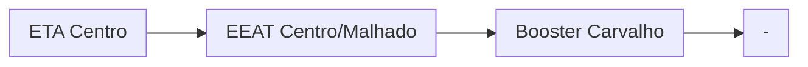

### Booster Carvalho (AUTAG)
| Parâmetro     | Valor |
| -------------    | ------------- |
| Início horário de ponta  | 12:00 |
| Final horário de ponta  | 23:59 |
| Desliga máx. jusante  | 60,0 mca|
| Liga mín. jusante  | 42,0 mca|
| Liga máx. montante  | 20,0 mca|
| Desliga mín. montante  | 4,0 mca|

Pontos relacionados:
- [49948360 - RUA RENOVAÇÃO 53](https://www.vectorasys.com.br/vectorasys/?inc=jE9ciFZdkq5eiPI/kPRdHL0fUgHpk249WBG4WAHeku9slPteHB1pGu94UrI0UrI=)
  
| Pressão     | Valor |
| -------------    | ------------- |
| Objetiva | 8 mca |
| Máxima | 12 mca  |

