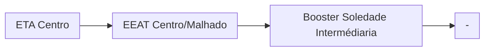

### Booster Soledade Intermediária (AUTAG)
| Parâmetro     | Valor |
| -------------    | ------------- |
| Início horário de ponta  | 12:00 |
| Final horário de ponta  | 23:59 |
| Desliga máx. jusante  | 65,0 mca|
| Liga mín. jusante  | 45,0 mca|
| Liga máx. montante  | 20,0 mca|
| Desliga mín. montante  | 4,0 mca|

Pontos relacionados:
- [49702934 - R NOSSA SENHORA DE LOURDES 159](https://www.vectorasys.com.br/vectorasys/?inc=jE9ciFZdkq5eiPI/kPRdHL0fUgHpk249WBCgVAHeku9slPteHB1pGu94UuC3HrU=)
- [49949304 - TERCEIRA TRAVESSA ALTO DA SOLE](https://www.vectorasys.com.br/vectorasys/?inc=jE9ciFZdkq5eiPI/kPRdHL0fUgHpk249WBCgVqHeku9slPteHB1pGu94UrM2GrU=)

