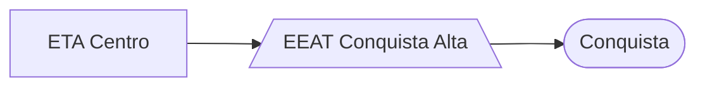

### EEAT Conquista Alta (AUTAG)

Abastecimento normalmente entre `01:30` e `13:00`

| Parâmetro     | Valor |
| -------------    | ------------- |
| Início horário de ponta  | 13:00 |
| Final horário de ponta  | 23:59 |
| Desliga máx. jusante  | 75,00 mca|
| Liga mín. jusante  | 40,00 mca|
| Liga máx. montante  | 2,10 m|
| Desliga mín. montante  | 1,20 m|
| Frequência  | 60 hz|
| Setpoint  | 64,00 mca|

Pontos relacionados:
- [49942766 - AVN BRASIL 411 HOSPITAL JOAQUI](https://www.vectorasys.com.br/vectorasys/?inc=jE9ciFZdkq5eiPI/kPRdHL0fUgHpk249WBQ3UAHeku9slPteHB1pGu94UrIeVBU=)
- [49952120 - AV CRISPIM JORGE DIAS CARINHO](https://www.vectorasys.com.br/vectorasys/?inc=jE9ciFZdkq5eiPI/kPRdHL0fUgHpk249WBY5VgHeku9slPteHB1pGu94UrY4VBY=)
- [49949200 - ARTHUR LAVIGNE 129](https://www.vectorasys.com.br/vectorasys/?inc=jE9ciFZdkq5eiPI/kPRdHL0fUgHpk249WBCeUKHeku9slPteHB1pGu94UuY0WBM=)
- [49951220 - AVN BEL MONTE 304](https://www.vectorasys.com.br/vectorasys/?inc=jE9ciFZdkq5eiPI/kPRdHL0fUgHpk249WBY5WKHeku9slPteHB1pGu94UuRrUBM=)
  

