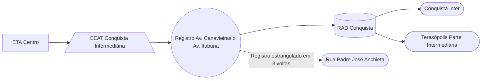

### EEAT Conquista Intermediária (AUTAG)

Abastecimento normalmente entre `03:00` e `12:00`

| Parâmetro     | Valor |
| -------------    | ------------- |
| Início horário de ponta  | 12:00 |
| Final horário de ponta  | 23:59 |
| Desliga máx. jusante  | 4,00 m|
| Liga mín. jusante  | 3,00 m|
| Liga máx. montante  | 2,10 m|
| Desliga mín. montante  | 1,20 m|
| Frequência  | 60,00 Hz |
| Setpoint  | 1,60 m |

Pontos relacionados:
- [49943485 - Rua Arthur Bernardes 365 MAT 4](https://www.vectorasys.com.br/vectorasys/?inc=jE9ciFZdkq5eiPI/kPRdHL0fUgHpk249WBQ3UKHeku9slPteHB1pGu94UrseWBQ=)
- [49947502 - RUA DAS PRATAS 347](https://www.vectorasys.com.br/vectorasys/?inc=jE9ciFZdkq5eiPI/kPRdHL0fUgHpk249WBYhVqHeku9slPteHB1pGu94UrlpGrU=)
- [49702644 - AVENIDA ITABUNA N.15](https://www.vectorasys.com.br/vectorasys/?inc=jE9ciFZdkq5eiPI/kPRdHL0fUgHpk249WBQ3UqHeku9slPteHB1pGu94UuGfUBU=)
- [49943286 - Rua Padre José Anchieta 115 MA](https://www.vectorasys.com.br/vectorasys/?inc=jE9ciFZdkq5eiPI/kPRdHL0fUgHpk249WBQ2VgHeku9slPteHB1pGu94UrUgWLM=)
  

