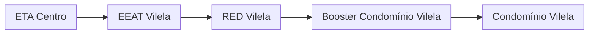

### Booster Condomínio Vilela (AUTAG)

Abastecimento normalmente entre `00:00` e `10:00`

| Parâmetro     | Valor |
| -------------    | ------------- |
| Início horário de ponta  | 13:00 |
| Final horário de ponta  | 23:59 |
| Desliga máx. jusante  | 80,0 mca|
| Liga mín. jusante  | 50,0 mca|
| Liga máx. montante  | 10,0 mca|
| Desliga mín. montante  | 4,0 mca|

Pontos relacionados:
- 49947183 - RESIDENCIAL VILÉLA RUA C B. 33](https://www.vectorasys.com.br/vectorasys/?inc=jE9ciFZdkq5eiPI/kPRdHL0fUgHpk249WBU3WKHeku9slPteHB1pGu94UuNpGhY=)

