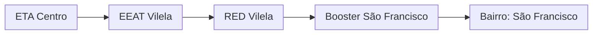

### Booster São Francisco (AUTAG)

Abastecimento normalmente entre `00:00` e `13:00`

| Parâmetro     | Valor |
| -------------    | ------------- |
| Início horário de ponta  | 13:00 |
| Final horário de ponta  | 23:59 |
| Desliga máx. jusante  | 25,0 mca|
| Liga mín. jusante  | 0,70 mca|
| Liga máx. montante  | 0,70 m|
| Desliga mín. montante  | 0,35 m|

Pontos relacionados:
- [49946507 - SAO JOÃO 493 MAT 46278583](https://www.vectorasys.com.br/vectorasys/?inc=jE9ciFZdkq5eiPI/kPRdHL0fUgHpk249WBU3VqHeku9slPteHB1pGu94UuVtVLI=)
- [49944753 - VILELA PARTE ALTA MAT 4663577!](https://www.vectorasys.com.br/vectorasys/?inc=jE9ciFZdkq5eiPI/kPRdHL0fUgHpk249WBUgUqHeku9slPteHB1pGu94UrDrVBM=)

