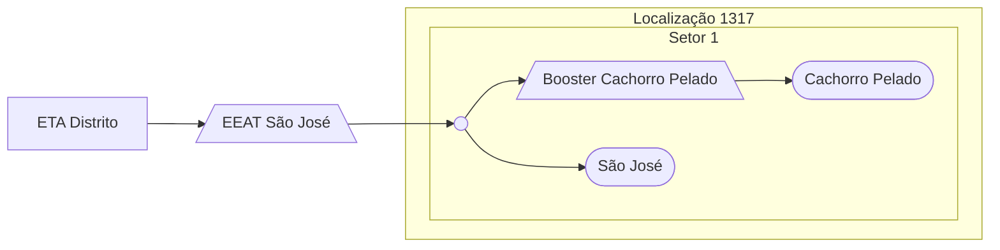

### Booster Cachorro Pelado (Local)

Abastecimento normalmente entre `06:00` e `10:00`

Acionamento por temporizador in loco 

| Parâmetro     | Valor |
| -------------    | ------------- |
| Início | 06:00 |
| Final | 10:00  |

Pontos relacionados:
- Cachorro Pelado
  - [49947962 - RUA BOA VISTA 482 SAO JOSE](https://www.vectorasys.com.br/vectorasys/?inc=jE9ciFZdkq5eiPI/kPRdHL0fUgHpk249WBG5VKHeku9slPteHB1pGu94UrIfGrC=)
  
| Pressão     | Valor |
| -------------    | ------------- |
| Objetiva | 10 mca |
| Máxima | 20 mca  |

