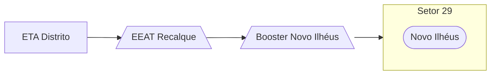

### Booster Novo Ilhéus (Local)

Abastecimento normalmente entre `04:00` e `12:00`

Acionamento por temporizador in loco 

| Parâmetro     | Valor |
| -------------    | ------------- |
| Início | 04:00 |
| Final | 13:30  |

Pontos relacionados:
- [49701345 - NOVO ILHEUS RUA NOSSA SENHORA](https://www.vectorasys.com.br/vectorasys/?inc=jE9ciFZdkq5eiPI/kPRdHL0fUgHpk249WBYgUKHeku9slPteHB1pGu94UrY4VrM=)
- [49949080 - NOVO ILHEUS NOSSA SENHORA APAR](https://www.vectorasys.com.br/vectorasys/?inc=jE9ciFZdkq5eiPI/kPRdHL0fUgHpk249WBYgUAHeku9slPteHB1pGu94UuY4GBI=)
  
| Pressão     | Valor |
| -------------    | ------------- |
| Objetiva | 10 mca |
| Máxima | 18 mca  |

