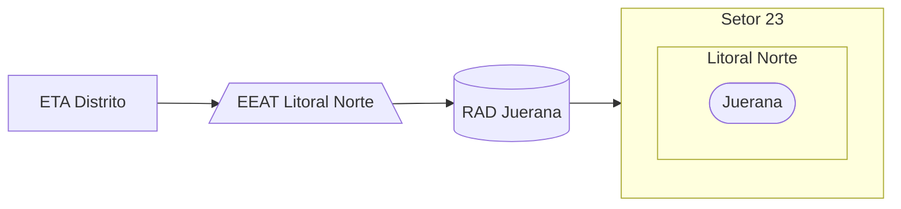

### EEAT Litoral Norte (AUTAG)

Abastecimento normalmente entre `04:00` e `05:00`

| Parâmetro     | Valor |
| -------------    | ------------- |
| Início horário de ponta  | 05:00 |
| Final horário de ponta  | 04:00 |
| Desliga máx. jusante  | 1,00 m |
| Liga mín. jusante  | 0,25 m |
| Liga máx. montante  | 0,95 m|
| Desliga mín. montante  | 0,90 m|
| Frequência  | 60 hz|
| Setpoint  | 1,00 m|

Pontos relacionados:
- Juerana
  - [49940200 - MACRO MEDIDOR JUERANA](https://www.vectorasys.com.br/vectorasys/?inc=jE9ciFZdkq5eiPI/kPRdHL0fUgHpk249WBk3VAHeku9slPteHB1pGu94UrJtVLM=)
  - [49702414 - MACRO MEDIDOR MAR E SOL*](https://www.vectorasys.com.br/vectorasys/?inc=jE9ciFZdkq5eiPI/kPRdHL0fUgHpk249WBk3VqHeku9slPteHB1pGu94UuHuULM=)

