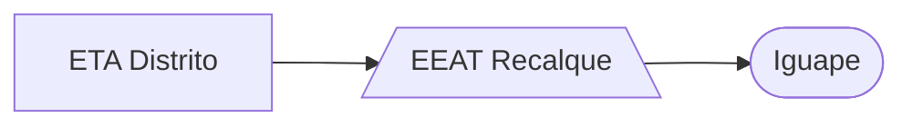

### EEAT Recalque (AUTAG)

Abastecimento normalmente entre `01:30` e `13:00`

| Parâmetro     | Valor |
| -------------    | ------------- |
| Início horário de ponta  | 13:00 |
| Final horário de ponta  | 23:59 |
| Desliga máx. jusante  | - |
| Liga mín. jusante  | - |
| Liga máx. montante  | 1,00 m|
| Desliga mín. montante  | 0,90 m|
| Frequência  | 60 hz|
| Setpoint  | 13,00 mca|

Pontos relacionados:
- [49938927 - RECALQUE MAT 46493247](https://www.vectorasys.com.br/vectorasys/?inc=jE9ciFZdkq5eiPI/kPRdHL0fUgHpk249WBYeUKHeku9slPteHB1pGu94UrQ4GhI=)
- [49921632 - RUA DO DETRA IGUAPE*](https://www.vectorasys.com.br/vectorasys/?inc=jE9ciFZdkq5eiPI/kPRdHL0fUgHpk249WBs2UqHeku9slPteHB1pGu94UrY3UhI=)
- [49935613 - IGUAPE MARIA LUIZA 777 MAT 463](https://www.vectorasys.com.br/vectorasys/?inc=jE9ciFZdkq5eiPI/kPRdHL0fUgHpk249WBYgUgHeku9slPteHB1pGu94UuQ5UrM=)
- [49947810 - AVN JOSE LUIS DA FONSECA 1009](https://www.vectorasys.com.br/vectorasys/?inc=jE9ciFZdkq5eiPI/kPRdHL0fUgHpk249WBG5WAHeku9slPteHB1pGu94Urs0VhM=)
  

