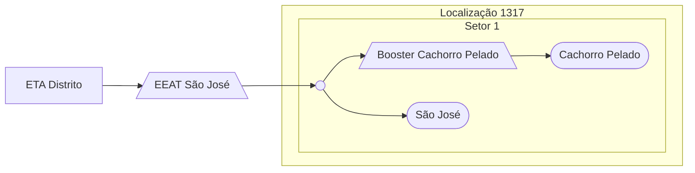

### EEAT São José (AUTAG)

Abastecimento normalmente entre `00:00` e `11:00`

| Parâmetro     | Valor |
| -------------    | ------------- |
| Início horário de ponta  | 11:00 |
| Final horário de ponta  | 23:59 |
| Desliga máx. jusante  | - |
| Liga mín. jusante  | - |
| Liga máx. montante  | 1,00 m|
| Desliga mín. montante  | 0,90 m|
| Frequência  | - |
| Setpoint  | - |

Pontos relacionados:
- Cachorro Pelado
  - [49947962 - RUA BOA VISTA 482 SAO JOSE](https://www.vectorasys.com.br/vectorasys/?inc=jE9ciFZdkq5eiPI/kPRdHL0fUgHpk249WBG5VKHeku9slPteHB1pGu94UrIfGrC=)

- São José
  - [49947854 - RODOVIA ILHEUS / URUÇUCA 1804](https://www.vectorasys.com.br/vectorasys/?inc=jE9ciFZdkq5eiPI/kPRdHL0fUgHpk249WBG5UqHeku9slPteHB1pGu94UuMhUhG=)
  

