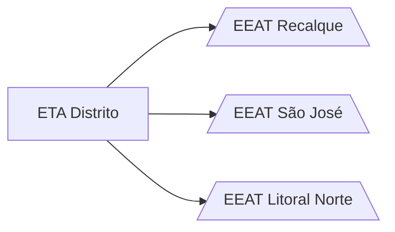

# ETA Distrito

## ℹ️ Informações
- Endereço: Estrada Carobeira
- Matrícula: 178795321
- Vazão: 250 m³/h
- Volume do RAD: 1400 m³
- Volume do RED: -

## 👷 Operadores
| Nome     | Empresa |
| -------------    | ------------- |
| Alessandro  | Porto Fino |
| André Macedo  | EMBASA |
| Antônio Carlos  | EMBASA|
| Edson  | Porto Fino |
| Idaízio  | EMBASA |

## 👷 Auxiliares
| Nome     | Empresa |
| -------------    | ------------- |
| Lico  | Porto Fino |

## 🧪 Produtos químicos

| Função     | Produto |
| -------------    | ------------- |
| Coagulante  | Polyfer|
| Alcalinizante  | Barrília |
| Desinfetante  | Cloro Gás |

## 📖 Índice

- [EEAT Recalque](EEAT%20Recalque.md)
- [EEAT São José](EEAT%20São%20José.md)
- [EEAT Litoral Norte](EEAT%20Litoral%20Norte.md)

