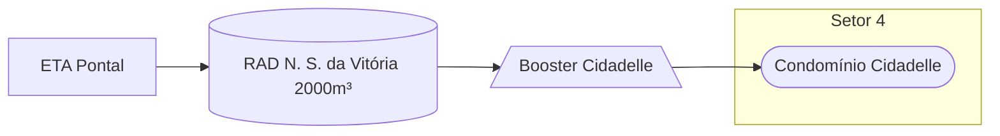

### Booster Cidadelle (Local)

Abastecimento normalmente entre `04:00` e `13:00`

Acionamento por temporizador in loco 

| Parâmetro     | Valor |
| -------------    | ------------- |
| Início | 04:00 |
| Final | 13:30  |

Pontos relacionados:
- [49942505 - CIDADELE QUADRA T](https://www.vectorasys.com.br/vectorasys/?inc=jE9ciFZdkq5eiPI/kPRdHL0fUgHpk249WBU0UAHeku9slPteHB1pGu94UrJrHrQ=)
  
| Pressão     | Valor |
| -------------    | ------------- |
| Objetiva | 10 mca |
| Máxima | 18 mca  |

