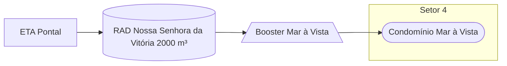

### Booster Mar à Vista (AUTAG)

Abastecimento normalmente entre `06:00` e `12:00`

| Parâmetro     | Valor |
| -------------    | ------------- |
| Início horário de ponta  | 00:00 |
| Final horário de ponta  | 06:00 |
| Desliga máx. jusante  | 90,00 mca |
| Liga mín. jusante  | 52,00 mca |
| Liga máx. montante  | 25,00 mca|
| Desliga mín. montante  | 4,00 mca|
| Frequência  | - |
| Setpoint  | - |

Pontos relacionados:
- Condomínio Mar à Vista
  - [49943440 - Condominio Mar a Vista](https://www.vectorasys.com.br/vectorasys/?inc=jE9ciFZdkq5eiPI/kPRdHL0fUgHpk249UBIgVhQukPRdHPZ5kOC9GERdmLQ0WOUg)

