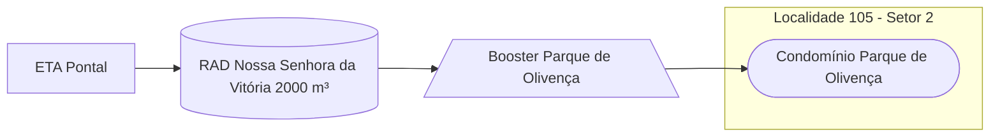

### Booster Parque de Olivença (Local)

Abastecimento normalmente entre `04:00` e `13:00`

Acionamento por temporizador localmente

| Parâmetro     | Valor |
| -------------    | ------------- |
| Início | 04:00 |
| Final | 13:30  |

Pontos relacionados:
- [49946143 - R MATA ATLÂNTICA 37 MAT. 50402](https://www.vectorasys.com.br/vectorasys/?inc=jE9ciFZdkq5eiPI/kPRdHL0fUgHpk249WBQgUKHeku9slPteHB1pGu94UuUfWLM=)
  
| Pressão     | Valor |
| -------------    | ------------- |
| Objetiva | 10 mca |
| Máxima | 18 mca  |

