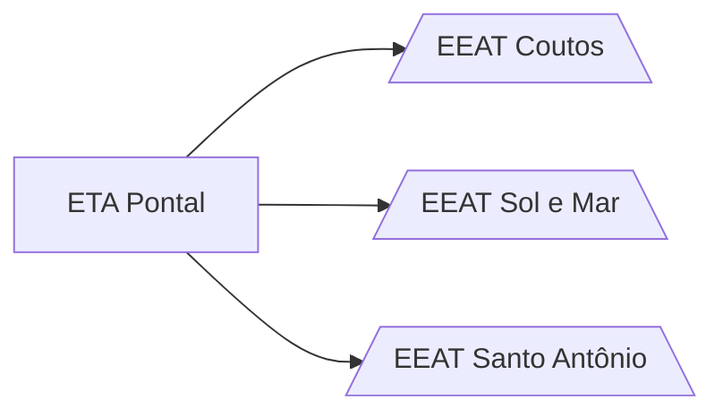

# ETA Pontal

## ℹ️ Informações
- Endereço: Rodovia Ilhéus - Buerarema SN
- Matrícula: 181538776
- Vazão: 850 m³/h
- Volume do RAD: -
- Volume do RED: -

## 👷 Operadores
| Nome     | Empresa |
| -------------    | ------------- |
| Thiago  | EMBASA |
| Lucas Santana  | EMBASA|
| Lucas Bomfim  | EMBASA |
| Melquizedeque  | EMBASA |
| Leandro  | EMBASA |

## 👷 Auxiliares
| Nome     | Empresa |
| -------------    | ------------- |
|   | Porto Fino |

## 🧪 Produtos químicos

| Função     | Produto |
| -------------    | ------------- |
| Coagulante  | Polyfer|
| Alcalinizante  | - |
| Desinfetante  | Cloro Gás |

## 📖 Índice

- [EEAT Coutos]()
- [EEAT SolEMar]()
- [EEAT SantoAntonio]()

