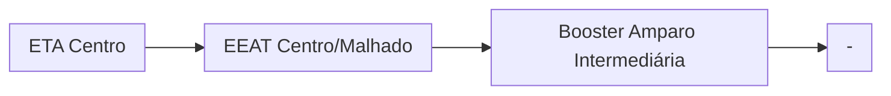
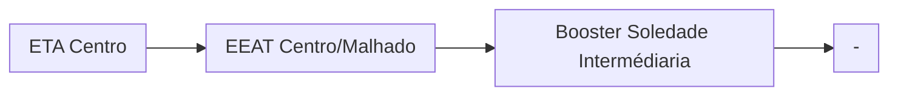

# Documentação CCO - Ilhéus

## Índice

### ETA Centro

- [EEAT Basílio](/Basilio)
- [EEAT Pacheco](#eeat-pacheco-autag)
- [EEAT Vilela](#eeat-vilela-autag)
  - [Booster São Francisco](#booster-são-francisco-autag)
  - [Booster Condomínio Vilela](#booster-condomínio-vilela-autag)
- [Booster Amparo Intermediária](#booster-amparo-intermediária-autag)
- [Booster Amparo Alta](#booster-amparo-alta-autag)
- [Booster Carvalho](#booster-carvalho-autag)
- [Booster Soledade Alta](#booster-soledade-alta-autag)
- [Booster Soledade Intermediária](#booster-soledade-intermediária-autag)
- [Booster Novo Ilhéus](#booster-novo-ilhéus-local)

## 🕐 Horários de ponta AUTAG

Ao ajustar os parâmetros do horário de ponta `inicial` e `final` de cada CMB, é preciso considerar a falta de sincronização com o relógio principal. 
Dependendo do setor que queira ajustar, utilize a tabela abaixo para configurar o horário exato.

| Setor     | Ajustar para |
| -------------    | ------------- |
| Captação Iguape  | 9 minutos `depois`|
| Captação do Engenho  | 1 minutos `depois`|
| ETA Centro       | 20 minutos `antes`|
| ETA Distrito     | 10 minutos `antes`|
| ETA Pontal     | Não funciona|
| Booster Mar a Vista     | 7 minutos `antes`|
| Booster Pérola do Mar  | 6 minutos `antes`|
| Booster Outeiro  | 12 minutos `antes`|
| Booster Mambape  | 8 minutos `antes`|
| Booster Pontal  | 19 minutos `depois`|
| Booster Condomínio Vilela  | 9 minutos `antes`|

## Abastecimentos ETA Centro

### EEAT Pacheco (AUTAG)

Abastecimento normalmente entre `03:00` e `13:00`

| Parâmetro     | Valor |
| -------------    | ------------- |
| Início horário de ponta  | 13:00 |
| Final horário de ponta  | 23:59 |
| Desliga máx. jusante  | 75,0 mca|
| Liga mín. jusante  | 40,0 mca|
| Liga máx. montante  | 2,10 m|
| Desliga mín. montante  | 1,20 m|
| Frequência  | 60 hz|
| Setpoint  | 58,0 mca|

Pontos relacionados:
- [49941405 - Rua 28 de junho 444 MAT 178801](https://www.vectorasys.com.br/vectorasys/?inc=jE9ciFZdkq5eiPI/kPRdHL0fUgHpk249WBQ2VAHeku9slPteHB1pGu94UrChULI=)
- [49942522 - Rua Madre Thais 108 MAT 461716](https://www.vectorasys.com.br/vectorasys/?inc=jE9ciFZdkq5eiPI/kPRdHL0fUgHpk249WBQ2VqHeku9slPteHB1pGu94UuMgVLI=)
  

### EEAT Vilela (AUTAG)

Abastecimento normalmente entre `22:00` e `14:00`

| Parâmetro     | Valor |
| -------------    | ------------- |
| Início horário de ponta  | 14:30 |
| Final horário de ponta  | 21:30 |
| Desliga máx. jusante  | 65,0 mca|
| Liga mín. jusante  | 1,0 mca|
| Liga máx. montante  | 2,10 m|
| Desliga mín. montante  | 1,20 m|
| Frequência  | 54 hz|
| Setpoint  | 1,50 m|

Pontos relacionados:
- [49924795 - MACRO TEOTÔNIO VILELA PONTE](https://www.vectorasys.com.br/vectorasys/?inc=jE9ciFZdkq5eiPI/kPRdHL0fUgHpk249WBU3VAHeku9slPteHB1pGu94UrVuULI=)
- [49951020 - RUA CESÁRIO DAS NEVES 198 S 17](https://www.vectorasys.com.br/vectorasys/?inc=jE9ciFZdkq5eiPI/kPRdHL0fUgHpk249WBCgUKHeku9slPteHB1pGu94UuQ0UhI=)
- [49943727 - RUA IPIRANGA 188 MAT 46518932](https://www.vectorasys.com.br/vectorasys/?inc=jE9ciFZdkq5eiPI/kPRdHL0fUgHpk249WBU3VgHeku9slPteHB1pGu94UrDtWLM=)
- [49921723 - RUA CONTORNO 563 MAT 46548025](https://www.vectorasys.com.br/vectorasys/?inc=jE9ciFZdkq5eiPI/kPRdHL0fUgHpk249WBUgVgHeku9slPteHB1pGu94UrJuWBQ=)  

### Booster São Francisco (AUTAG)

Abastecimento normalmente entre `00:00` e `13:00`

| Parâmetro     | Valor |
| -------------    | ------------- |
| Início horário de ponta  | 13:00 |
| Final horário de ponta  | 23:59 |
| Desliga máx. jusante  | 25,0 mca|
| Liga mín. jusante  | 0,70 mca|
| Liga máx. montante  | 0,70 m|
| Desliga mín. montante  | 0,35 m|

Pontos relacionados:
- [49946507 - SAO JOÃO 493 MAT 46278583](https://www.vectorasys.com.br/vectorasys/?inc=jE9ciFZdkq5eiPI/kPRdHL0fUgHpk249WBU3VqHeku9slPteHB1pGu94UuVtVLI=)
- [49944753 - VILELA PARTE ALTA MAT 4663577!](https://www.vectorasys.com.br/vectorasys/?inc=jE9ciFZdkq5eiPI/kPRdHL0fUgHpk249WBUgUqHeku9slPteHB1pGu94UrDrVBM=)

### Booster Condomínio Vilela (AUTAG)

Abastecimento normalmente entre `00:00` e `10:00`

| Parâmetro     | Valor |
| -------------    | ------------- |
| Início horário de ponta  | 13:00 |
| Final horário de ponta  | 23:59 |
| Desliga máx. jusante  | 80,0 mca|
| Liga mín. jusante  | 50,0 mca|
| Liga máx. montante  | 10,0 mca|
| Desliga mín. montante  | 4,0 mca|

Pontos relacionados:
- 49947183 - RESIDENCIAL VILÉLA RUA C B. 33](https://www.vectorasys.com.br/vectorasys/?inc=jE9ciFZdkq5eiPI/kPRdHL0fUgHpk249WBU3WKHeku9slPteHB1pGu94UuNpGhY=)

### Booster Amparo Intermediária (AUTAG)
| Parâmetro     | Valor |
| -------------    | ------------- |
| Início horário de ponta  | 12:00 |
| Final horário de ponta  | 23:59 |
| Desliga máx. jusante  | 62,0 mca|
| Liga mín. jusante  | 35,0 mca|
| Liga máx. montante  | 20,0 mca|
| Desliga mín. montante  | 4,0 mca|

Pontos relacionados:
- [49942567 - RUA AUGUSTO LOPES 281 MAT 4626](https://www.vectorasys.com.br/vectorasys/?inc=jE9ciFZdkq5eiPI/kPRdHL0fUgHpk249WBU4UgHeku9slPteHB1pGu94UrHtGrG=)

### Booster Amparo Alta (AUTAG)
| Parâmetro     | Valor |
| -------------    | ------------- |
| Início horário de ponta  | 12:00 |
| Final horário de ponta  | 23:59 |
| Desliga máx. jusante  | 80,0 mca|
| Liga mín. jusante  | 58,0 mca|
| Liga máx. montante  | 20,0 mca|
| Desliga mín. montante  | 4,0 mca|

Pontos relacionados:
- [49947823 - RUA AMENDOEIRA 226 MAT 4662169](https://www.vectorasys.com.br/vectorasys/?inc=jE9ciFZdkq5eiPI/kPRdHL0fUgHpk249WBU4VKHeku9slPteHB1pGu94UrDrHrY=)
- [49701925 - OITAVA TRAVESSA LEGIÃO 53 S 33](https://www.vectorasys.com.br/vectorasys/?inc=jE9ciFZdkq5eiPI/kPRdHL0fUgHpk249WBCgWAHeku9slPteHB1pGu94UuCgHrG=)
- [49701960 - R BELA VISTA ALTO D LEGIÃO S33](https://www.vectorasys.com.br/vectorasys/?inc=jE9ciFZdkq5eiPI/kPRdHL0fUgHpk249WBChUKHeku9slPteHB1pGu94UrQ0VrM=)

### Booster Carvalho (AUTAG)
| Parâmetro     | Valor |
| -------------    | ------------- |
| Início horário de ponta  | 12:00 |
| Final horário de ponta  | 23:59 |
| Desliga máx. jusante  | 60,0 mca|
| Liga mín. jusante  | 42,0 mca|
| Liga máx. montante  | 20,0 mca|
| Desliga mín. montante  | 4,0 mca|

Pontos relacionados:
- [49948360 - RUA RENOVAÇÃO 53](https://www.vectorasys.com.br/vectorasys/?inc=jE9ciFZdkq5eiPI/kPRdHL0fUgHpk249WBG4WAHeku9slPteHB1pGu94UrI0UrI=)
  
| Pressão     | Valor |
| -------------    | ------------- |
| Objetiva | 8 mca |
| Máxima | 12 mca  |

### Booster Soledade Alta (AUTAG)
| Parâmetro     | Valor |
| -------------    | ------------- |
| Início horário de ponta  | 12:00 |
| Final horário de ponta  | 23:59 |
| Desliga máx. jusante  | 85,0 mca|
| Liga mín. jusante  | 45,0 mca|
| Liga máx. montante  | 20,0 mca|
| Desliga mín. montante  | 4,0 mca|

Pontos relacionados:
- [49950883 - QUINTA TRAVESSA ALTO DA SOLEDA](https://www.vectorasys.com.br/vectorasys/?inc=jE9ciFZdkq5eiPI/kPRdHL0fUgHpk249WBCgWKHeku9slPteHB1pGu94UrkgUhk=)
- [49949335 - Sétima Travessa Alto da Soleni](https://www.vectorasys.com.br/vectorasys/?inc=jE9ciFZdkq5eiPI/kPRdHL0fUgHpk249WBCgVgHeku9slPteHB1pGu94Uro2VhQ=)

### Booster Soledade Intermediária (AUTAG)
| Parâmetro     | Valor |
| -------------    | ------------- |
| Início horário de ponta  | 12:00 |
| Final horário de ponta  | 23:59 |
| Desliga máx. jusante  | 65,0 mca|
| Liga mín. jusante  | 45,0 mca|
| Liga máx. montante  | 20,0 mca|
| Desliga mín. montante  | 4,0 mca|

Pontos relacionados:
- [49702934 - R NOSSA SENHORA DE LOURDES 159](https://www.vectorasys.com.br/vectorasys/?inc=jE9ciFZdkq5eiPI/kPRdHL0fUgHpk249WBCgVAHeku9slPteHB1pGu94UuC3HrU=)
- [49949304 - TERCEIRA TRAVESSA ALTO DA SOLE](https://www.vectorasys.com.br/vectorasys/?inc=jE9ciFZdkq5eiPI/kPRdHL0fUgHpk249WBCgVqHeku9slPteHB1pGu94UrM2GrU=)

### Booster Novo Ilhéus (Local)

Abastecimento normalmente entre `04:00` e `13:00`

Acionamento por temporizador in loco 

| Parâmetro     | Valor |
| -------------    | ------------- |
| Início | 04:00 |
| Final | 13:30  |

Pontos relacionados:
- [49949080 - NOVO ILHEUS NOSSA SENHORA APAR](https://www.vectorasys.com.br/vectorasys/?inc=jE9ciFZdkq5eiPI/kPRdHL0fUgHpk249WBYgUAHeku9slPteHB1pGu94UuY4GBI=)
  
| Pressão     | Valor |
| -------------    | ------------- |
| Objetiva | 10 mca |
| Máxima | 18 mca  |

### Booster Parque de Olivença (Local)

Abastecimento normalmente entre `04:00` e `13:00`

Acionamento por temporizador in loco 

| Parâmetro     | Valor |
| -------------    | ------------- |
| Início | 04:00 |
| Final | 13:30  |

Pontos relacionados:
- [49946143 - R MATA ATLÂNTICA 37 MAT. 50402](https://www.vectorasys.com.br/vectorasys/?inc=jE9ciFZdkq5eiPI/kPRdHL0fUgHpk249WBQgUKHeku9slPteHB1pGu94UuUfWLM=)
  
| Pressão     | Valor |
| -------------    | ------------- |
| Objetiva | 10 mca |
| Máxima | 18 mca  |

### Booster Cidadele (Local)

Abastecimento normalmente entre `04:00` e `13:00`

Acionamento por temporizador in loco 

| Parâmetro     | Valor |
| -------------    | ------------- |
| Início | 04:00 |
| Final | 13:30  |

Pontos relacionados:
- [49942505 - CIDADELE QUADRA T](https://www.vectorasys.com.br/vectorasys/?inc=jE9ciFZdkq5eiPI/kPRdHL0fUgHpk249WBU0UAHeku9slPteHB1pGu94UrJrHrQ=)
  
| Pressão     | Valor |
| -------------    | ------------- |
| Objetiva | 10 mca |
| Máxima | 18 mca  |

## Abastecimentos
