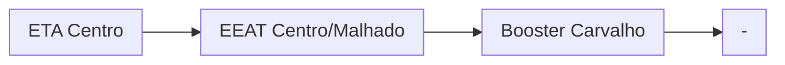

# Documentação CCO - Ilhéus

## 🕐 Horários de ponta AUTAG

Ao ajustar os parâmetros do horário de ponta `inicial` e `final` de cada CMB, é preciso considerar a falta de sincronização com o relógio principal. 
Dependendo do setor que queira ajustar, utilize a tabela abaixo para configurar o horário exato.

| Setor     | Ajustar para |
| -------------    | ------------- |
| Captação Iguape  | 7 minutos `depois`|
| Captação do Engenho  | 1 minutos `depois`|
| ETA Centro       | 20 minutos `antes`|
| ETA Distrito     | 10 minutos `antes`|
| ETA Pontal     | Não funciona|
| Booster Mar a Vista     | 7 minutos `antes`|
| Booster Pérola do Mar  | 6 minutos `antes`|
| Booster Outeiro  | 12 minutos `antes`|
| Booster Mambape  | 8 minutos `antes`|
| Booster Pontal  | 19 minutos `depois`|

## Abastecimentos

### Booster Amparo Intermediário (AUTAG)
| Parâmetro     | Valor |
| -------------    | ------------- |
| Início horário de ponta  | 12:00 |
| Final horário de ponta  | 23:59 |
| Desliga máx. jusante  | 62,0 mca|
| Liga mín. jusante  | 35,0 mca|
| Liga máx. montante  | 20,0 mca|
| Desliga mín. montante  | 4,0 mca|

### Booster Amparo Alto
| Parâmetro     | Valor |
| -------------    | ------------- |
| Início horário de ponta  | 12:00 |
| Final horário de ponta  | 23:59 |
| Desliga máx. jusante  | 80,0 mca|
| Liga mín. jusante  | 58,0 mca|
| Liga máx. montante  | 20,0 mca|
| Desliga mín. montante  | 4,0 mca|

### Booster Carvalho
| Parâmetro     | Valor |
| -------------    | ------------- |
| Início horário de ponta  | 12:00 |
| Final horário de ponta  | 23:59 |
| Desliga máx. jusante  | 60,0 mca|
| Liga mín. jusante  | 42,0 mca|
| Liga máx. montante  | 20,0 mca|
| Desliga mín. montante  | 4,0 mca|

Pontos relacionados:
- [49948360 - RUA RENOVAÇÃO 53](https://www.vectorasys.com.br/vectorasys/?inc=jE9ciFZdkq5eiPI/kPRdHL0fUgHpk249WBG4WAHeku9slPteHB1pGu94UrI0UrI=)
  
| Pressão     | Valor |
| -------------    | ------------- |
| Objetiva | 8 mca |
| Máxima | 12 mca  |

### Booster Soledade Alta
| Parâmetro     | Valor |
| -------------    | ------------- |
| Início horário de ponta  | 12:00 |
| Final horário de ponta  | 23:59 |
| Desliga máx. jusante  | 85,0 mca|
| Liga mín. jusante  | 45,0 mca|
| Liga máx. montante  | 20,0 mca|
| Desliga mín. montante  | 4,0 mca|

### Booster Soledade Intermediária (AUTAG)
| Parâmetro     | Valor |
| -------------    | ------------- |
| Início horário de ponta  | 12:00 |
| Final horário de ponta  | 23:59 |
| Desliga máx. jusante  | 65,0 mca|
| Liga mín. jusante  | 45,0 mca|
| Liga máx. montante  | 20,0 mca|
| Desliga mín. montante  | 4,0 mca|

### Booster Novo Ilhéus (Local)
| Parâmetro     | Valor |
| -------------    | ------------- |
| Início | 04:00 |
| Final | 13:30  |

Pontos relacionados:
- [49949080 - NOVO ILHEUS NOSSA SENHORA APAR](https://www.vectorasys.com.br/vectorasys/?inc=jE9ciFZdkq5eiPI/kPRdHL0fUgHpk249WBYgUAHeku9slPteHB1pGu94UuY4GBI=)
  
| Pressão     | Valor |
| -------------    | ------------- |
| Objetiva | 10 mca |
| Máxima | 18 mca  |

## Abastecimentos
